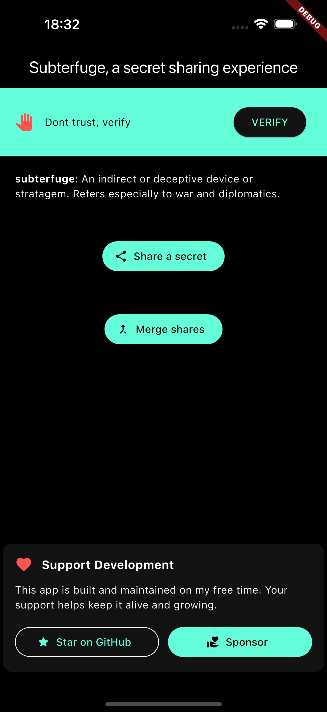
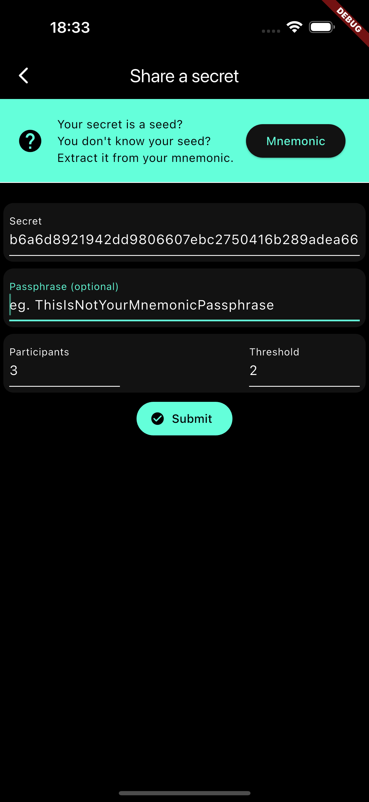
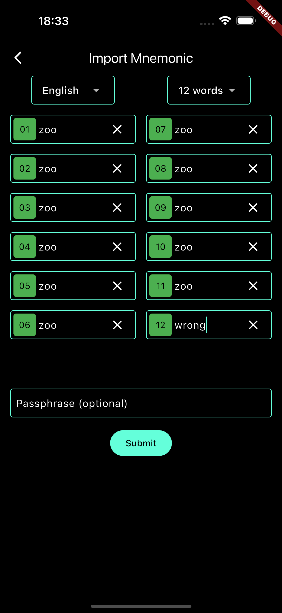
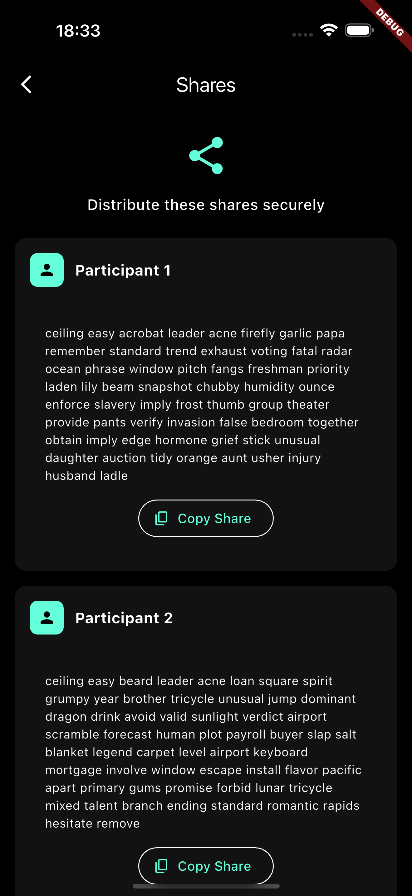
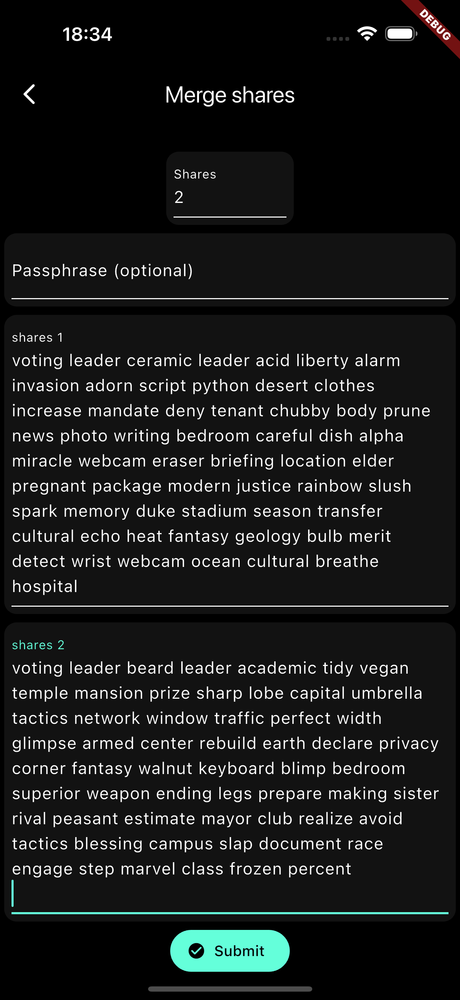
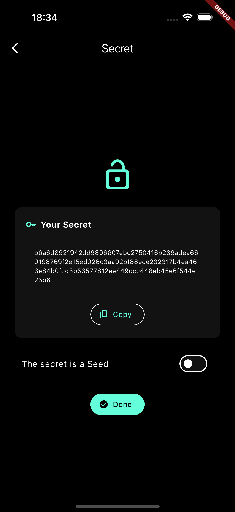

[](https://www.gnu.org/licenses/gpl-3.0)
[](https://github.com/ethicnology/subterfuge/actions/workflows/build.yaml)

# subterfuge

[Try it here](https://ethicnology.github.io/subterfuge/)

<!-- [](https://snapcraft.io/subterfuge)   -->


A Shamir Secret Sharing tool implementing the SLIP39 standard.

## About

In November 1979, Adi Shamir published [How to Share a Secret](https://dl.acm.org/doi/pdf/10.1145/359168.359176). Years later, with the rise of cryptocurrencies, the need to manage private keys for groups (like non-profits or companies) rather than just individuals brought this concept back to the forefront.

Shamir's threshold scheme allows a group of individuals—even those who may not fully trust one another—to cooperate. Access requires mutual consent, defined by a specific threshold of shares.

[SLIP39](https://github.com/satoshilabs/slips/blob/master/slip-0039.md) (SatoshiLabs Improvement Proposal no. 39) formalizes Shamir's Secret Sharing for Seeds, allowing secrets to be backed up as a set of easy-to-remember words.

This application implements SLIP39 using [Flutter](https://flutter.dev/), Google's open-source framework, enabling a single codebase to run natively on **Linux, Web, Android, Windows, macOS, and iOS**.

## Disclaimer

**Always verify that you can recover your secret from your shares before relying on them.**

This application uses [slip39-dart](https://github.com/ilap/slip39-dart). **As this dependency is still beta, use it at your own risk.** Please consider supporting [ilap's](https://github.com/ilap) work.

## Usage

Eliminate single points of failure for your secrets and keys using these methods:

### Backup

Securing a seed (from a mnemonic) is difficult. Subterfuge helps you create a scheme (e.g., 5 total shares with a recovery threshold of 3) that allows you to distribute shares across different locations.

### Organizations

Manage access to services, hardware, or documents using a shared secret scheme. This requires a specific number of authorized individuals to collaborate to gain access.

### Legacy

Secure documents and funds for your heirs. Create a recovery scheme that allows your relatives to access your digital assets only when necessary (e.g., in case of death).

## [Support my work](http://support.ethicnology.com?app=furtive)

## Screenshots

<p float="left">
  
   
  
  
  
  
  
</p>

## DIY

```sh
curl -fsSL https://fvm.app/install.sh | bash
fvm install
fvm flutter pub get
fvm dart run build_runner build --delete-conflicting-outputs
fvm flutter build
```


## Dataset

Mnemonic
```
zoo zoo zoo zoo zoo zoo zoo zoo zoo zoo zoo wrong
```

Seed
```sh
b6a6d8921942dd9806607ebc2750416b289adea669198769f2e15ed926c3aa92bf88ece232317b4ea463e84b0fcd3b53577812ee449ccc448eb45e6f544e25b6
```

2/3 shares 
```sh
voting leader beard leader academic tidy vegan temple mansion prize sharp lobe capital umbrella tactics network window traffic perfect width glimpse armed center rebuild earth declare privacy corner fantasy walnut keyboard blimp bedroom superior weapon ending legs prepare making sister rival peasant estimate mayor club realize avoid tactics blessing campus slap document race engage step marvel class frozen percent

voting leader ceramic leader acid liberty alarm invasion adorn script python desert clothes increase mandate deny tenant chubby body prune news photo writing bedroom careful dish alpha miracle webcam eraser briefing location elder pregnant package modern justice rainbow slush spark memory duke stadium season transfer cultural echo heat fantasy geology bulb merit detect wrist webcam ocean cultural breathe hospital
```
